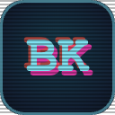

  

<h1 align="center">Brandon Kelly — Portfolio</h1>

  <a href="#introduction">Introduction</a> ·
  <a href="#about-me">About Me</a> ·
  <a href="#tech-stack">Tech Stack</a> ·
  <a href="#more-to-come">More to Come</a>

---

## Introduction

A personal portfolio site with a retro arcade / CRT theme, built to showcase my
projects, skills, and experience. Visitors can browse selected work and reach out
through the contact form.

## About Me

I'm Brandon, a software engineer and web developer based out of Tokyo, who enjoys turning ideas into
polished, playful web apps.
I've only been at this for a few months so a few of the projects are learner projects.
One that I am especially proud of is Kanjutsu, a Japanese learning app.
I like clean code, thoughtful UI, and giving projects a bit of personality. Feel
free to explore the site and reach out about any questions or opportunities to
collaborate.

## Tech Stack

**Runtime & server**
- [Node.js](https://nodejs.org/) (>= 22)
- [Express 5](https://expressjs.com/) — web framework
- [EJS](https://ejs.co/) — server-rendered templates
- [morgan](https://github.com/expressjs/morgan) — request logging
- [body-parser](https://github.com/expressjs/body-parser) — form/JSON parsing

**Contact form**
- [Google Sheets API](https://developers.google.com/sheets/api) via [`googleapis`](https://github.com/googleapis/google-api-nodejs-client) — submissions are appended as rows to a Google Sheet using a service account
- [dotenv](https://github.com/motdotla/dotenv) — environment configuration

**Frontend**
- Custom CSS — a hand-built CRT / pixel arcade theme
- Google Fonts — *Press Start 2P* and *Space Grotesk*

**Tooling & hosting**
- [nodemon](https://nodemon.io/) — live reload in development
- [CircleCI](https://circleci.com/) — continuous integration
- [Render](https://render.com/) — deployment

## More to Come

This site is a work in progress. Next up: **gamification** — bringing the arcade
theme to life with interactive, game-like touches throughout the experience.
Stay tuned. 🕹️
